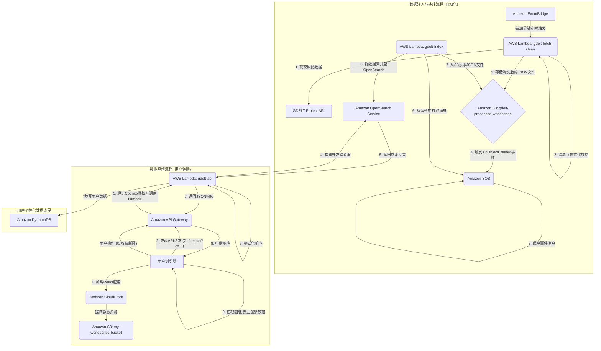

# AWS 服务在 WorldSense-GDELT 项目中的作用 (中文版)

本文档详细阐述了 WorldSense-GDELT 项目所集成的14个核心AWS服务，以及它们各自在本系统架构中扮演的具体角色和功能。

---

### 1. AWS Lambda (无服务器计算)

AWS Lambda 是整个系统的**计算核心**，负责执行所有后端业务逻辑，使我们无需管理任何服务器。

- **`gdelt-fetch-clean`**: 定时（由EventBridge触发）执行的函数，用于从GDELT数据源获取最新数据，进行清洗和标准化，然后存入S3数据湖。
- **`gdelt-index`**: 由S3事件触发的函数，当新数据文件存入S3后，此函数会自动读取文件内容，并将其索引到Amazon OpenSearch Service中。
- **`gdelt-api`**: 作为前端应用的API后端，由API Gateway触发。它负责处理所有来自客户端的请求，如数据查询、用户认证和个性化数据读写。

### 2. Amazon S3 (对象存储)

Amazon S3 在系统中扮演**静态网站托管**和**数据湖**的双重角色。

- **静态网站托管**: `my-worldsense-bucket` 存储桶用于存放前端React应用的所有静态文件（HTML, CSS, JS）。用户通过CloudFront访问这些内容。
- **数据湖与事件源**: `gdelt-processed-worldsense` 存储桶作为数据处理管道的中心，存储清洗后的GDELT数据（JSON格式）。当新文件写入时，它会自动生成一个`Put`事件，触发`gdelt-index` Lambda函数，是事件驱动架构的关键一环。

### 3. Amazon API Gateway (API网关)

API Gateway 是连接前端应用和后端Lambda服务的**前门**，负责管理和保护API。

- **HTTP端点**: 为`gdelt-api` Lambda函数创建公开的HTTP端点，接收来自前端的RESTful API请求。
- **请求路由**: 根据请求的URL路径和HTTP方法，将请求路由到相应的后端逻辑。
- **安全与授权**: 与Amazon Cognito集成，验证请求中的JWT令牌，确保只有登录用户才能访问受保护的API。

### 4. Amazon DynamoDB (NoSQL数据库)

DynamoDB 是一个高性能的键值对NoSQL数据库，用于存储**用户相关的个性化数据**。

- **用户收藏**: 当用户在地图上收藏某条新闻时，相关信息（用户ID、新闻ID等）会存储在DynamoDB中。
- **用户偏好**: 存储用户的个性化设置，如界面偏好、默认搜索条件等。

### 5. Amazon Cognito (用户认证服务)

Cognito 提供了完整的用户身份管理和认证功能，负责处理**用户注册、登录和会话管理**。

- **用户池 (User Pools)**: 管理所有注册用户的身份信息（如用户名、密码、邮箱）。
- **身份验证**: 处理用户的登录请求，验证凭据成功后，会签发JWT（JSON Web Tokens）给客户端。前端在后续的API请求中会携带此令牌。

### 6. Amazon CloudFront (内容分发网络 - CDN)

CloudFront 是我们的全球内容分发网络，用于**加速内容分发和提升安全性**。

- **加速前端访问**: 将托管在S3上的静态网站内容缓存到全球各地的边缘节点，用户可以从最近的节点加载应用，大大降低了延迟。
- **统一入口**: 作为整个应用的单一入口点，将发往`/api/*`路径的请求转发给API Gateway，其他请求则转发给S3前端资源，简化了CORS（跨域资源共享）配置。
- **HTTPS加密**: 为所有数据传输提供SSL/TLS加密，保障通信安全。

### 7. Amazon OpenSearch Service (搜索引擎)

OpenSearch Service 是本项目的**核心数据检索引擎**，提供了强大的搜索和分析能力。

- **数据索引**: 存储从GDELT数据集中提取并格式化的新闻事件数据。
- **复杂查询**: 支持前端应用的各种复杂查询需求，包括全文搜索、地理空间查询（Geo-spatial Query）、时间范围过滤以及数据聚合（用于生成统计图表）。

### 8. AWS IAM (身份与访问管理)

IAM 是AWS的**安全基石**，通过精细的权限控制来保障所有云资源的安全。

- **角色与策略**: 为Lambda函数、API Gateway等每个AWS服务组件创建了拥有最小必要权限的IAM角色。例如，`gdelt-index`函数只有读取S3和写入OpenSearch的权限，遵循“最小权限原则”。
- **跨账户访问**: 管理外部AWS账户访问本系统资源的权限。

### 9. Amazon CloudWatch (监控与日志)

CloudWatch 提供了全面的**监控、日志记录和警报**功能。

- **日志记录 (Logs)**: 集中收集所有Lambda函数的执行日志，方便开发者进行问题排查和调试。
- **性能监控 (Metrics)**: 实时监控关键性能指标，如Lambda函数的调用次数、执行时长、错误率等。
- **警报 (Alarms)**: 设置警报阈值，例如当月账单超过预设金额时，可以自动发送通知，用于成本控制和异常检测。

### 10. Amazon EventBridge (事件总线与调度器)

EventBridge 在此项目中主要用作**定时任务调度器**。

- **定时触发**: 配置了一个cron表达式规则，每15分钟自动触发`gdelt-fetch-clean` Lambda函数，实现了数据管道的自动化、周期性执行。

### 11. Amazon SNS (简单通知服务)

SNS 是一种发布/订阅消息服务，用于**发送系统状态通知**。

- **操作通知**: `gdelt-fetch-clean`函数在数据处理成功或失败时，会通过SNS发布一条消息。运维团队可以订阅这个主题，通过邮件或短信等方式接收实时通知，以便及时了解系统健康状况。

### 12. Amazon SQS (简单队列服务)

SQS 是一种消息队列服务，用于**解耦系统组件，提升可靠性**。

- **缓冲与解耦**: 在S3和`gdelt-index` Lambda之间可以加入SQS队列。当S3产生大量文件上传事件时，可以将事件消息先发送到队列中，Lambda函数再按照自己的处理能力从队列中拉取消息。这可以防止瞬间流量冲垮下游服务，并能通过死信队列（DLQ）处理失败的消息，增强了数据索引的鲁棒性。

### 13. AWS Secrets Manager (密钥管理)

Secrets Manager 用于**安全地存储和管理敏感信息**，如数据库凭证、API密钥等。

- **凭证管理**: `gdelt-api` Lambda函数在需要连接OpenSearch集群时，会通过API动态地从Secrets Manager中获取数据库的用户名和密码，而不是将这些敏感信息硬编码在代码或环境变量中，极大地提升了安全性。

### 14. Amazon VPC (虚拟私有云)

VPC 用于在AWS云中创建一个**逻辑隔离的网络环境**，以增强安全性。

- **网络隔离**: 将OpenSearch集群和Lambda函数等后端资源放置在VPC内部。通过配置安全组（Security Groups）和网络访问控制列表（NACLs），可以精确控制进出这些资源的流量，例如只允许VPC内的Lambda函数访问OpenSearch集群，从而防止未经授权的外部访问。

---

### 15. 数据流程

为了更直观地理解系统各组件如何协同工作，以下是本项目的核心数据流程图。

#### 数据流程图 (Mermaid)

#### 流程详解:

1.  **数据注入与处理 (Data Ingestion and Processing)**:
    *   **EventBridge** 作为一个定时器，每15分钟唤醒 `gdelt-fetch-clean` Lambda。
    *   该Lambda从GDELT项目API获取最新数据，进行处理后存入 **S3** 的 `gdelt-processed-worldsense` 存储桶。
    *   文件上传到S3后，S3会发送一个事件通知到 **SQS** 队列。使用SQS是为了缓冲可能突发的大量文件事件，起到削峰填谷的作用，保护下游服务。
    *   `gdelt-index` Lambda持续从SQS队列中拉取消息，得知有新文件需要处理。
    *   `gdelt-index` Lambda从S3读取对应的文件，并将其内容批量索引到 **OpenSearch** 集群中，以便后续查询。

2.  **数据查询 (Data Query)**:
    *   用户浏览器通过 **CloudFront** 加速访问并加载托管在 **S3** `my-worldsense-bucket` 上的React前端应用。
    *   当用户在界面上进行搜索或筛选操作时，前端应用会向 **API Gateway** 发送一个携带 **Cognito** 签发的认证令牌的API请求。
    *   API Gateway验证令牌后，将请求转发给 `gdelt-api` Lambda。
    *   `gdelt-api` Lambda根据请求参数构建一个查询，发送给 **OpenSearch** 服务。
    *   OpenSearch执行查询并返回结果给Lambda。
    *   Lambda处理并格式化结果后，通过API Gateway将最终的JSON数据返回给前端。
    *   前端接收到数据后，将其渲染在Leaflet地图和Chart.js图表上。
    *   如果操作涉及用户个性化数据（如收藏），`gdelt-api` Lambda会与 **DynamoDB** 进行交互。
