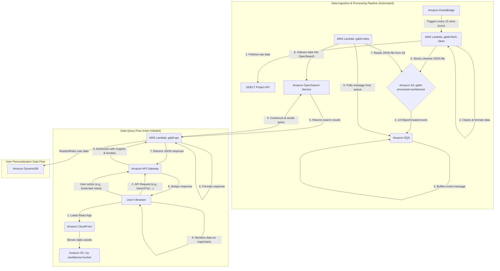

# Role of AWS Services in the WorldSense-GDELT Project (English Version)

This document provides a detailed explanation of the 14 core AWS services integrated into the WorldSense-GDELT project and their specific roles and functions within the system architecture.

---

### 1. AWS Lambda (Serverless Compute)

AWS Lambda is the **computational core** of the entire system, responsible for executing all backend business logic without the need to manage any servers.

- **`gdelt-fetch-clean`**: A function executed on a schedule (triggered by EventBridge) to fetch the latest data from the GDELT data source, clean and standardize it, and then store it in the S3 data lake.
- **`gdelt-index`**: A function triggered by S3 events. When a new data file is stored in S3, this function automatically reads the file content and indexes it into Amazon OpenSearch Service.
- **`gdelt-api`**: Serves as the API backend for the frontend application, triggered by API Gateway. It handles all client requests, such as data queries, user authentication, and personalized data read/write operations.

### 2. Amazon S3 (Simple Storage Service)

Amazon S3 serves a dual role in the system as both a **static website host** and a **data lake**.

- **Static Website Hosting**: The `my-worldsense-bucket` is used to store all the static files (HTML, CSS, JS) of the frontend React application. Users access this content via CloudFront.
- **Data Lake and Event Source**: The `gdelt-processed-worldsense` bucket acts as the central hub for the data processing pipeline, storing the cleaned GDELT data in JSON format. When a new file is written, it automatically generates a `Put` event that triggers the `gdelt-index` Lambda function, a key component of the event-driven architecture.

### 3. Amazon API Gateway (API Management)

API Gateway is the **front door** that connects the frontend application to the backend Lambda services, responsible for managing and securing the APIs.

- **HTTP Endpoints**: It creates public HTTP endpoints for the `gdelt-api` Lambda function, receiving RESTful API requests from the frontend.
- **Request Routing**: It routes incoming requests to the appropriate backend logic based on the URL path and HTTP method.
- **Security and Authorization**: It integrates with Amazon Cognito to validate the JWT tokens in requests, ensuring that only authenticated users can access protected APIs.

### 4. Amazon DynamoDB (NoSQL Database)

DynamoDB is a high-performance, key-value NoSQL database used to store **user-related personalized data**.

- **User Bookmarks**: When a user bookmarks a news event on the map, the relevant information (e.g., user ID, event ID) is stored in DynamoDB.
- **User Preferences**: It stores user-specific settings, such as UI preferences and default search criteria.

### 5. Amazon Cognito (User Identity and Authentication)

Cognito provides a complete solution for user identity management and authentication, handling **user registration, sign-in, and session management**.

- **User Pools**: Manages the identity information of all registered users (e.g., username, password, email).
- **Authentication**: Processes user login requests and, upon successful credential validation, issues JSON Web Tokens (JWTs) to the client. The frontend includes this token in subsequent API requests.

### 6. Amazon CloudFront (Content Delivery Network - CDN)

CloudFront is our global CDN, used to **accelerate content delivery and enhance security**.

- **Accelerate Frontend Access**: Caches the static website content from S3 at edge locations worldwide, allowing users to load the application from the nearest node, significantly reducing latency.
- **Unified Entry Point**: Serves as a single entry point for the entire application, forwarding requests for `/api/*` to API Gateway and all other requests to the S3 frontend, which simplifies CORS configuration.
- **HTTPS Encryption**: Provides SSL/TLS encryption for all data in transit, ensuring secure communication.

### 7. Amazon OpenSearch Service (Search Engine)

OpenSearch Service is the **core data retrieval engine** of the project, providing powerful search and analytics capabilities.

- **Data Indexing**: Stores the news event data extracted and formatted from the GDELT dataset.
- **Complex Queries**: Supports various complex query needs of the frontend application, including full-text search, geo-spatial queries, time-range filtering, and data aggregations (for generating statistical charts).

### 8. AWS IAM (Identity and Access Management)

IAM is the **security foundation** of AWS, ensuring the security of all cloud resources through fine-grained access control.

- **Roles and Policies**: Creates IAM roles with the minimum necessary permissions for each AWS service component, such as Lambda functions and API Gateway. For example, the `gdelt-index` function only has permissions to read from S3 and write to OpenSearch, following the "Principle of Least Privilege."
- **Cross-Account Access**: Manages permissions for external AWS accounts to access resources in this system.

### 9. Amazon CloudWatch (Monitoring and Logging)

CloudWatch provides comprehensive **monitoring, logging, and alerting** functionalities.

- **Logs**: Centralizes and collects execution logs from all Lambda functions, facilitating troubleshooting and debugging for developers.
- **Metrics**: Monitors key performance indicators in real-time, such as Lambda invocation counts, execution duration, and error rates.
- **Alarms**: Allows setting up alarm thresholds. For example, it can send a notification when the monthly bill exceeds a preset amount, which is useful for cost control and anomaly detection.

### 10. Amazon EventBridge (Event Bus and Scheduler)

In this project, EventBridge is primarily used as a **scheduled task trigger**.

- **Scheduled Triggers**: A cron expression rule is configured to automatically trigger the `gdelt-fetch-clean` Lambda function every 15 minutes, enabling the automated, periodic execution of the data pipeline.

### 11. Amazon SNS (Simple Notification Service)

SNS is a pub/sub messaging service used for **sending system status notifications**.

- **Operational Notifications**: The `gdelt-fetch-clean` function publishes a message via SNS upon the success or failure of a data processing job. The operations team can subscribe to this topic to receive real-time notifications via email or SMS, allowing them to monitor system health.

### 12. Amazon SQS (Simple Queue Service)

SQS is a message queue service used to **decouple system components and improve reliability**.

- **Buffering and Decoupling**: An SQS queue can be placed between S3 and the `gdelt-index` Lambda. When a large number of file upload events occur in S3, the event messages can be sent to the queue first. The Lambda function can then pull messages from the queue at its own processing pace. This prevents sudden traffic spikes from overwhelming downstream services and allows for failed messages to be handled via a Dead-Letter Queue (DLQ), enhancing the robustness of the data indexing process.

### 13. AWS Secrets Manager (Secret Management)

Secrets Manager is used to **securely store and manage sensitive information**, such as database credentials and API keys.

- **Credential Management**: When the `gdelt-api` Lambda function needs to connect to the OpenSearch cluster, it dynamically retrieves the username and password from Secrets Manager via an API call, rather than hardcoding this sensitive information in the code or environment variables. This greatly enhances security.

### 14. Amazon VPC (Virtual Private Cloud)

A VPC is used to create a **logically isolated network environment** within the AWS cloud to enhance security.

- **Network Isolation**: Backend resources like the OpenSearch cluster and Lambda functions are placed inside a VPC. By configuring Security Groups and Network Access Control Lists (NACLs), traffic in and out of these resources can be precisely controlled. For example, it can be configured to only allow the Lambda functions within the VPC to access the OpenSearch cluster, thereby preventing unauthorized external access.

---

### 15. Data Flow

To better understand how the various components of the system work together, below is a diagram illustrating the core data flows of the project.

#### Data Flow Diagram (Mermaid)

#### Flow Explanation:

1.  **Data Ingestion and Processing**:
    *   **EventBridge** acts as a scheduler, invoking the `gdelt-fetch-clean` Lambda every 15 minutes.
    *   This Lambda fetches the latest data from the GDELT Project API, processes it, and stores it in the `gdelt-processed-worldsense` bucket on **S3**.
    *   The file upload to S3 sends an event notification to an **SQS** queue. Using SQS serves to buffer a potential burst of file events, acting as a shock absorber to protect downstream services.
    *   The `gdelt-index` Lambda continuously polls the SQS queue for messages, indicating that new files are ready to be processed.
    *   The `gdelt-index` Lambda reads the corresponding file from S3 and bulk-indexes its content into the **OpenSearch** cluster for subsequent querying.

2.  **Data Query**:
    *   The user's browser loads the React frontend application, which is hosted on the **S3** `my-worldsense-bucket` and delivered globally with low latency via **CloudFront**.
    *   When the user performs a search or filter action on the UI, the frontend sends an API request to **API Gateway**, including an authentication token issued by **Cognito**.
    *   API Gateway validates the token and forwards the request to the `gdelt-api` Lambda.
    *   The `gdelt-api` Lambda constructs a query based on the request parameters and sends it to the **OpenSearch** service.
    *   OpenSearch executes the query and returns the results to the Lambda.
    *   The Lambda processes and formats the results, then returns the final JSON data to the frontend via API Gateway.
    *   The frontend receives the data and renders it on the Leaflet map and Chart.js charts.
    *   If the user's action involves personalized data (e.g., bookmarking), the `gdelt-api` Lambda interacts with **DynamoDB**.
