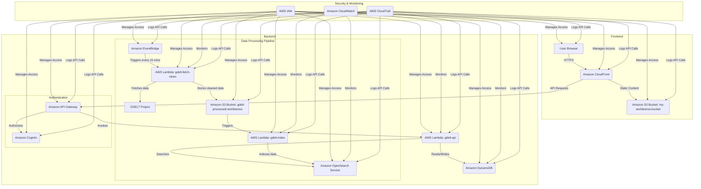

# WorldSense-GDELT Technical Documentation

This document provides a detailed technical overview of the WorldSense-GDELT project, including its architecture, components, and deployment process.

## 1. System Architecture

The WorldSense-GDELT platform is built on a serverless architecture using Amazon Web Services (AWS). This design ensures scalability, cost-efficiency, and high availability.

### 1.1. Core AWS Services

The following AWS services are used in this project:

- **AWS Lambda**: For running backend code without provisioning or managing servers.
- **Amazon S3**: For storing the frontend application and processed GDELT data.
- **Amazon API Gateway**: To create, publish, maintain, monitor, and secure APIs at any scale.
- **Amazon DynamoDB**: As a NoSQL database for storing user data and application state.
- **Amazon Cognito**: For user authentication and authorization.
- **Amazon CloudFront**: As a content delivery network (CDN) to securely deliver data, videos, applications, and APIs to customers globally with low latency and high transfer speeds.
- **Amazon OpenSearch Service**: For indexing and searching the GDELT data.
- **AWS IAM**: To manage access to AWS services and resources securely.
- **Amazon CloudWatch**: For monitoring and logging.
- **Amazon EventBridge**: To trigger the data fetching Lambda function on a schedule.
- **Amazon SNS**: For sending notifications.
- **Amazon SQS**: To decouple and scale microservices, distributed systems, and serverless applications.
- **AWS Secrets Manager**: For managing secrets.
- **Amazon VPC**: To isolate the backend resources in a virtual private cloud.

### 1.2. Architecture Diagram



## 2. Components

### 2.1. Frontend

The frontend is a single-page application (SPA) built with **React** and **Vite**. It uses the following key libraries:

- **React Leaflet**: For the interactive map visualization.
- **Chart.js**: For data visualization and charts.
- **AWS Amplify**: For integrating with AWS Cognito for user authentication.

The frontend is hosted on an **Amazon S3 bucket** and distributed through **Amazon CloudFront** for low-latency access.

### 2.2. Backend

The backend is composed of three main AWS Lambda functions:

1.  **`gdelt-fetch-clean`**: This function is triggered by an **Amazon EventBridge** rule every 15 minutes. It fetches the latest GDELT data, cleans it, and stores it in the `gdelt-processed-worldsense` S3 bucket.
2.  **`gdelt-index`**: This function is triggered by S3 `put` events in the `gdelt-processed-worldsense` bucket. It takes the cleaned data, transforms it, and indexes it into the **Amazon OpenSearch Service** cluster for searching.
3.  **`gdelt-api`**: This function is triggered by **Amazon API Gateway**. It handles all API requests from the frontend, such as searching for events, getting statistics, and user-specific actions. It queries the OpenSearch cluster and returns the results to the frontend.

### 2.3. Data Storage

- **Amazon S3**:
    - `my-worldsense-bucket`: Stores the static frontend assets (HTML, CSS, JavaScript).
    - `gdelt-processed-worldsense`: Acts as a data lake, storing the cleaned GDELT data in JSON format.
- **Amazon OpenSearch Service**: An OpenSearch cluster is used to index the GDELT data for fast and complex search queries.
- **Amazon DynamoDB**: A DynamoDB table is used to store user-specific data, such as saved searches and preferences.

## 3. Deployment

The project uses a CI/CD pipeline with **GitHub Actions** for automated deployment. The workflow is defined in `.github/workflows/deploy.yml`.

The deployment process is as follows:

1.  **Push to `main` branch**: A push to the `main` branch triggers the GitHub Actions workflow.
2.  **Build Frontend**: The workflow builds the React application.
3.  **Deploy to S3**: The built frontend assets are synced to the `my-worldsense-bucket` S3 bucket.
4.  **Invalidate CloudFront Cache**: The CloudFront distribution cache is invalidated to ensure users get the latest version of the application.
5.  **Deploy Lambda Functions**: The Lambda functions are packaged and deployed using the AWS CLI or a custom deployment script.

The infrastructure is managed as code using **Terraform**, as defined in `infrastructure/terraform/main.tf`.

## 4. How to Run Locally

To run the frontend locally for development, follow these steps:

1.  **Clone the repository**:
    ```bash
    git clone https://github.com/your-username/worldsense-gdelt.git
    cd worldsense-gdelt
    ```
2.  **Install dependencies**:
    ```bash
    npm install
    ```
3.  **Set up environment variables**:
    Create a `.env.local` file in the root of the project and add the following environment variables:
    ```
    VITE_API_BASE_URL=https://82z3xjob1g.execute-api.us-east-1.amazonaws.com/prod
    VITE_COGNITO_USER_POOL_ID=your_cognito_user_pool_id
    VITE_COGNITO_CLIENT_ID=your_cognito_client_id
    VITE_COGNITO_REGION=us-east-1
    ```
4.  **Run the development server**:
    ```bash
    npm run dev
    ```
The application will be available at `http://localhost:5173`.
