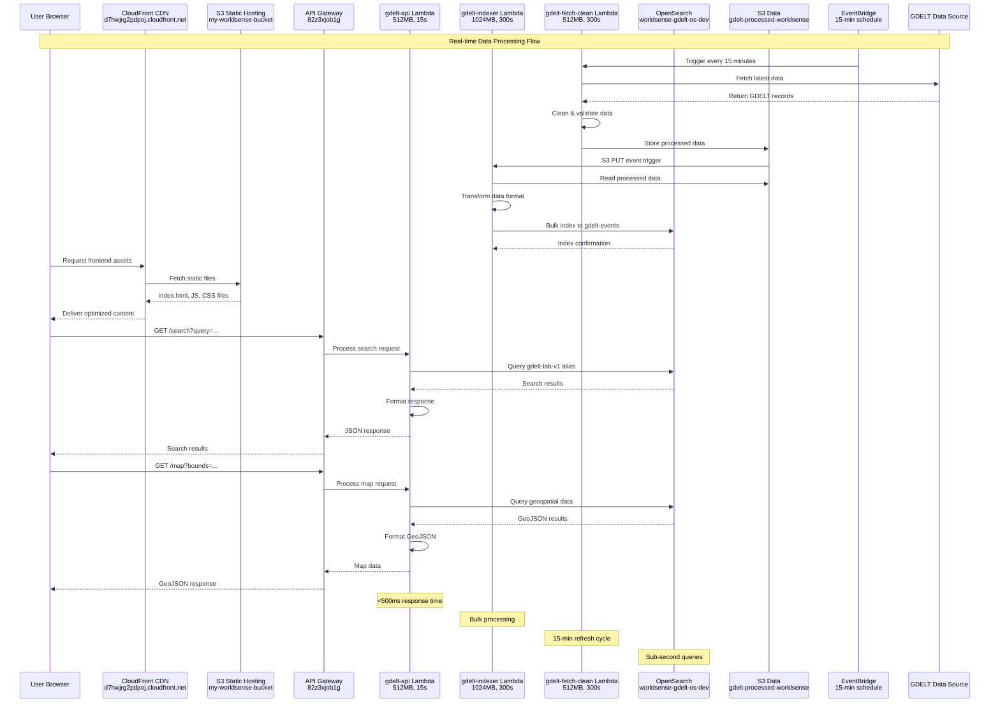
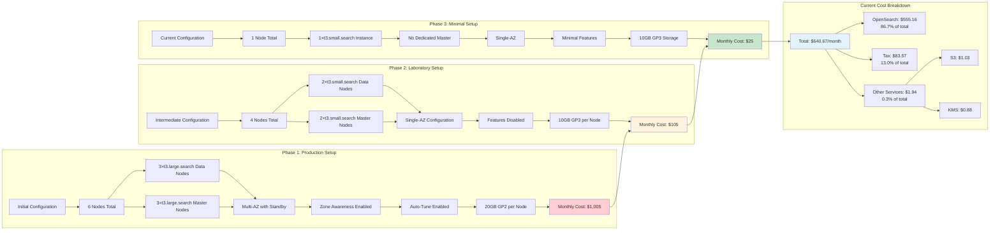
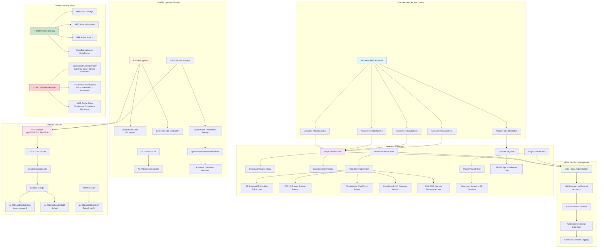

# 修复的图表 - 基于真实AWS配置

## 用户功能图 - 修复版本

```mermaid
graph TD
    subgraph "User Authentication Flow"
        A[User Browser] --> B[Cognito User Pool<br/>worldsense-users<br/>us-east-1_Wfn3se9zs]
        B --> C[JWT Token Management]
        C --> D[Session Storage]
    end
    
    subgraph "Frontend Assets Loading"
        E[CloudFront CDN<br/>d7hwjrg2pdpoj.cloudfront.net] --> F[S3 Static Hosting<br/>my-worldsense-bucket]
        F --> G[index.html]
        F --> H[index-v3.0-CEYIod4a.js]
        F --> I[leaflet-v3.0-CcbFxbU7.js]
        F --> J[vendor-v3.0-CNkaGmpG.js]
        F --> K[index-v3.0-B6lqBTfR.css]
    end
    
    subgraph "Interactive Mapping Features"
        L[Leaflet.js Global Map] --> M[Real-time Event Clusters]
        M --> N[Heat Map Visualization]
        N --> O[Geographic Filtering]
        O --> P[Country/Region Selection]
        P --> Q[Distance-based Search]
        Q --> R[Sub-second Response]
    end
    
    subgraph "Data Visualization Features"
        S[Chart.js Analytics] --> T[Time-series Line Charts]
        S --> U[Statistical Bar Charts]
        S --> V[Event Distribution Pie Charts]
        T --> W[Multi-timeframe Views<br/>Hourly/Daily/Weekly/Monthly/Yearly]
        U --> W
        V --> W
        W --> X[Interactive Zoom & Pan]
    end
    
    subgraph "Advanced Search Interface"
        Y[Search Form] --> Z[Time Range Picker]
        Y --> AA[Geographic Boundary Selector]
        Y --> BB[Sentiment Score Slider]
        Y --> CC[Event Category Checkboxes]
        Z --> DD[API Query Builder]
        AA --> DD
        BB --> DD
        CC --> DD
        DD --> EE[<500ms Query Response]
    end
    
    subgraph "API Endpoints Integration"
        FF[/search API<br/>82z3xjob1g.execute-api.us-east-1.amazonaws.com/prod/search] --> GG[Complex Query Processing]
        HH[/map API<br/>82z3xjob1g.execute-api.us-east-1.amazonaws.com/prod/map] --> II[GeoJSON Data Format]
        JJ[/stats API<br/>82z3xjob1g.execute-api.us-east-1.amazonaws.com/prod/stats] --> KK[Pre-calculated Aggregations]
    end
    
    A --> E
    D --> L
    D --> S
    D --> Y
    R --> HH
    X --> JJ
    EE --> FF
    
    style A fill:#e3f2fd
    style B fill:#fff3e0
    style E fill:#e1f5fe
    style L fill:#f3e5f5
    style S fill:#e8f5e8
    style Y fill:#fce4ec
    style FF fill:#f1f8e9
```

## 整体架构图 - 修复版本

```mermaid
graph TB
    subgraph "User Access Layer"
        A[Web Browser] --> B[CloudFront Distribution<br/>E3MJ8UIOB3UH8Q<br/>d7hwjrg2pdpoj.cloudfront.net]
        B --> C[S3 Static Website<br/>my-worldsense-bucket]
    end
    
    subgraph "API Gateway Layer"
        D[HTTP API Gateway<br/>worldsense-gdelt-api<br/>82z3xjob1g] --> E[Route: GET /search]
        D --> F[Route: GET /map]
        D --> G[Route: GET /stats]
        H[REST API Gateway<br/>gdelt-api<br/>sqeg4ixx58] --> I[Backup Endpoint]
    end
    
    subgraph "Lambda Functions Layer"
        J[gdelt-api Lambda<br/>Python 3.13<br/>512MB, 15s timeout<br/>gdelt-api-role] --> K[Main API Processing]
        L[gdelt-indexer Lambda<br/>Python 3.13<br/>1024MB, 300s timeout<br/>gdelt-indexer-role] --> M[Data Indexing Processing]
        N[gdelt-fetch-clean Lambda<br/>Python 3.13<br/>512MB, 300s timeout<br/>gdelt-lambda-role] --> O[Scheduled Data Collection]
    end
    
    subgraph "OpenSearch Service Layer"
        P[OpenSearch Domain<br/>worldsense-gdelt-os-dev] --> Q[Endpoint:<br/>search-worldsense-gdelt-os-dev-tfuw6rzu5dpjqqjfhsjy3lszxa.us-east-1.es.amazonaws.com]
        Q --> R[2×t3.small.search Data Nodes]
        Q --> S[2×t3.small.search Master Nodes]
        Q --> T[10GB GP3 EBS per Node<br/>3000 IOPS, 125MB/s]
        Q --> U[Index: gdelt-events<br/>Alias: gdelt-lab-v1]
    end
    
    subgraph "S3 Storage Layer"
        V[S3 Data Lake] --> W[Frontend Bucket<br/>my-worldsense-bucket]
        V --> X[Processed Data Bucket<br/>gdelt-processed-worldsense]
        V --> Y[Audit Logs Bucket<br/>aws-cloudtrail-logs-810731468776-c013728b]
        X --> Z[Lifecycle Policy<br/>30-day Glacier transition]
    end
    
    subgraph "Authentication & Security"
        AA[Cognito User Pool<br/>worldsense-users<br/>us-east-1_Wfn3se9zs] --> BB[User Authentication]
        CC[IAM Cross-Account Roles] --> DD[Project-Admin Role]
        CC --> EE[Project-Developer Role]
        CC --> FF[Project-Viewer Role]
        GG[AWS Secrets Manager<br/>opensearch/worldsense/indexer] --> HH[OpenSearch Credentials]
    end
    
    subgraph "Event Processing"
        II[EventBridge Rule<br/>GDELTFetchEvery15min<br/>rate(15 minutes)] --> N
        JJ[S3 Event Notifications] --> L
        KK[SNS Topics] --> LL[Standard Topic]
        KK --> MM[FIFO Topic]
    end
    
    C --> D
    D --> J
    E --> J
    F --> J
    G --> J
    J --> P
    J --> X
    L --> P
    L --> X
    N --> X
    II --> N
    J --> AA
    J --> GG
    L --> GG
    N --> GG
    
    style A fill:#e3f2fd
    style B fill:#e1f5fe
    style D fill:#f3e5f5
    style J fill:#e8f5e8
    style P fill:#fff3e0
    style V fill:#fce4ec
    style AA fill:#f1f8e9
    style II fill:#fff8e1
```

## 数据流程图 - 修复版本



## 成本优化流程图 - 修复版本



## 安全架构图 - 修复版本



