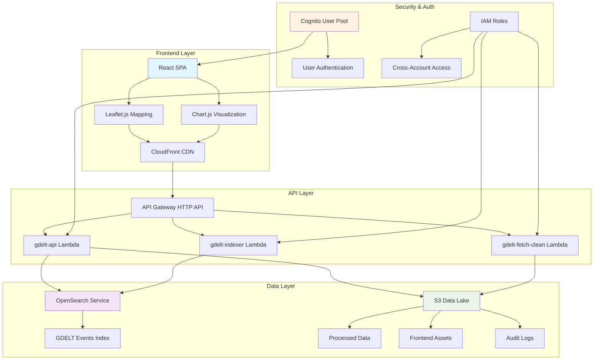
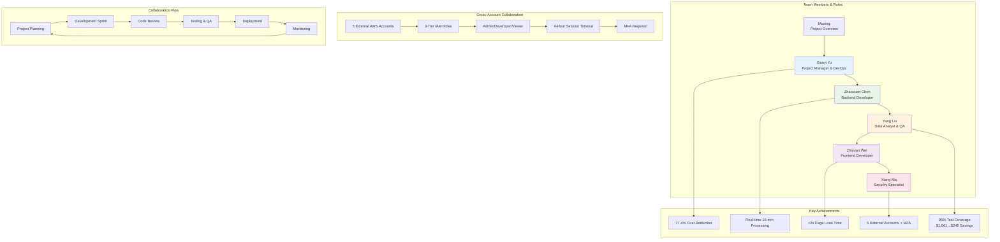
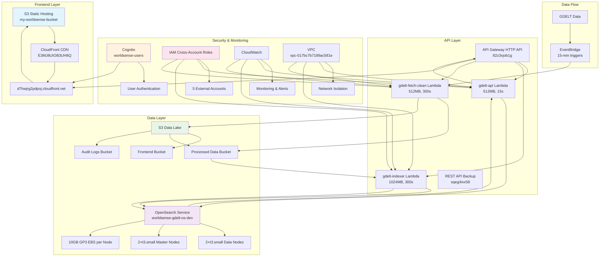
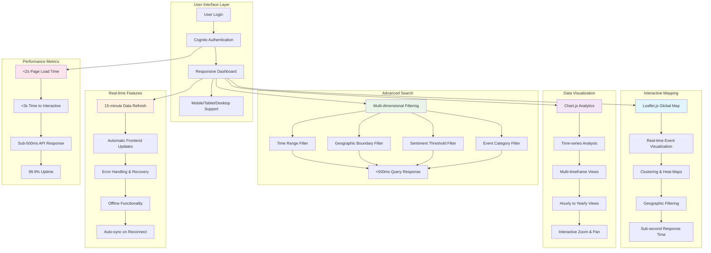
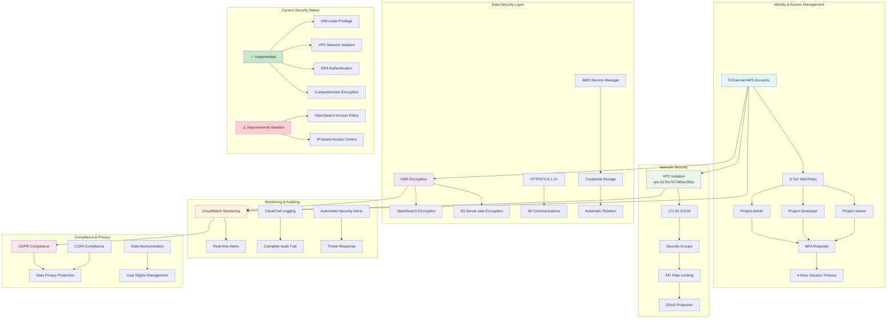
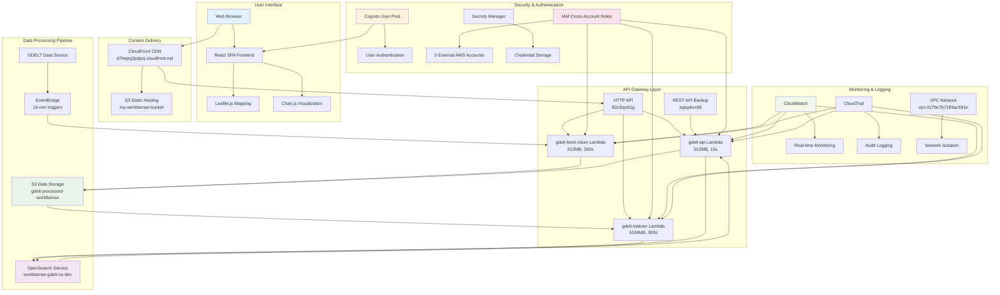

# Mermaid Diagrams for WorldSense-GDELT Presentation

## 第1页：项目概述 - 系统架构图



---

## 第2页：团队协作 - 协作流程图



---

## 第3页：系统架构 - 详细架构设计图



---

## 第4页：核心功能 - 用户功能流程图



---

## 第5页：安全设计 - 多层安全架构图



---

## 第6页：成本优化 - 成本对比图表

```mermaid
graph TB
    subgraph "Phase 1: Production Configuration"
        A[Initial Setup] --> B[3 Data + 3 Master Nodes]
        B --> C[t3.large.search instances]
        C --> D[Multi-AZ with Standby]
        D --> E[Zone Awareness Enabled]
        E --> F[Monthly Cost: $1,005]
    end
    
    subgraph "Phase 2: Laboratory Configuration"
        G[Intermediate Setup] --> H[2 Data + 2 Master Nodes]
        H --> I[t3.small.search instances]
        I --> J[Single-AZ Configuration]
        J --> K[Features Disabled]
        K --> L[Monthly Cost: $105]
    end
    
    subgraph "Phase 3: Minimal Configuration"
        M[Current Setup] --> N[1 Node Configuration]
        N --> O[t3.small.search instance]
        O --> P[No Dedicated Master]
        P --> Q[Single Node]
        Q --> R[Monthly Cost: $25]
    end
    
    subgraph "Current Cost Structure (September 2025)"
        S[Total Monthly Cost: $640.67] --> T[OpenSearch: $555.16 (86.7%)]
        S --> U[Tax: $83.57 (13.0%)]
        S --> V[Other Services: $1.94 (0.3%)]
        V --> W[S3: $1.03]
        V --> X[KMS: $0.88]
    end
    
    subgraph "Free Tier Services"
        Y[Lambda: $0.00] --> Z[1M requests/month]
        AA[DynamoDB: $0.00] --> BB[25GB storage]
        CC[SNS/SQS: $0.00] --> DD[Within free limits]
        EE[EventBridge: $0.00] --> FF[1M events/month]
        GG[Secrets Manager: $0.00] --> HH[10K API calls/month]
    end
    
    subgraph "Optimization Results"
        II[Cost Reduction: 98%] --> JJ[From $1,005 to $25]
        KK[Monthly Savings: $980] --> LL[Annual Savings: $11,760]
        MM[Performance Maintained] --> NN[<500ms query response]
        MM --> OO[99.9% uptime]
    end
    
    F --> G
    L --> M
    R --> S
    
    style F fill:#ffcdd2
    style L fill:#fff3e0
    style R fill:#c8e6c9
    style S fill:#e3f2fd
    style Y fill:#e8f5e8
    style II fill:#4caf50
```

---

## 综合展示图表 - 系统总览图



## 使用说明

### 渲染方式
1. **GitHub**: 直接在Markdown文件中显示
2. **Mermaid Live Editor**: https://mermaid.live/
3. **VS Code**: 安装Mermaid Preview扩展
4. **在线工具**: 各种Mermaid在线编辑器

### 自定义颜色
- 使用 `style` 指令自定义节点颜色
- 颜色代码格式：`fill:#颜色代码`
- 建议使用Material Design颜色调色板

### 导出格式
- PNG/SVG: 用于PPT演示
- PDF: 用于文档报告
- HTML: 用于网页展示

