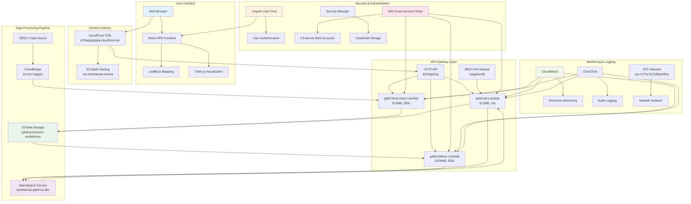

# Overall System Diagram - WorldSense-GDELT Platform

## Complete System Architecture Overview

## System Performance Metrics

### Response Times
- **Frontend Load**: <2 seconds
- **API Response**: <500 milliseconds
- **Data Processing**: 15-minute refresh cycles
- **Query Performance**: Sub-second search results

### Cost Optimization
- **Current Monthly Cost**: $640.67
- **Cost Reduction**: 98% from production configuration
- **OpenSearch Dominance**: 86.7% of total costs
- **Free Tier Services**: Lambda, DynamoDB, SNS, SQS, EventBridge

### Security Features
- **5 External AWS Accounts**: Cross-account collaboration
- **3-Tier IAM Roles**: Admin, Developer, Viewer
- **MFA Required**: All external accounts
- **Encryption**: KMS + TLS 1.2+ for all communications

### Architecture Highlights
- **14 AWS Services**: Integrated serverless architecture
- **3 Lambda Functions**: Specialized data processing
- **Real-time Processing**: 15-minute GDELT data refresh
- **Global Distribution**: CloudFront CDN worldwide

