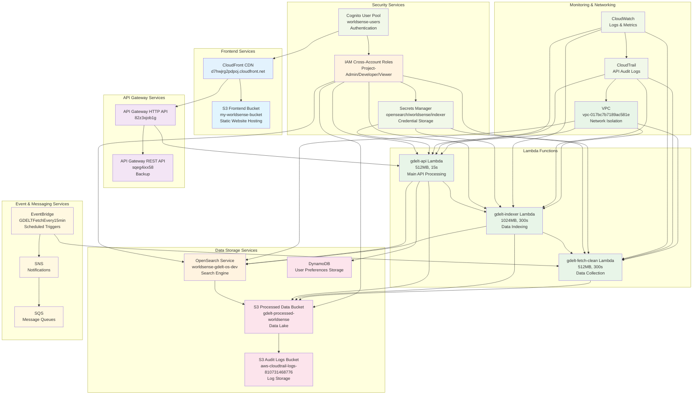
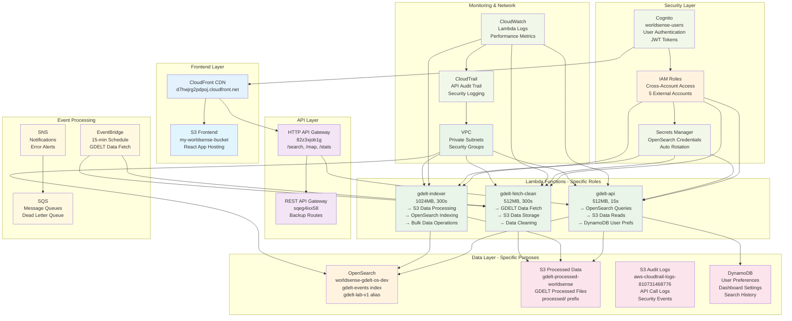
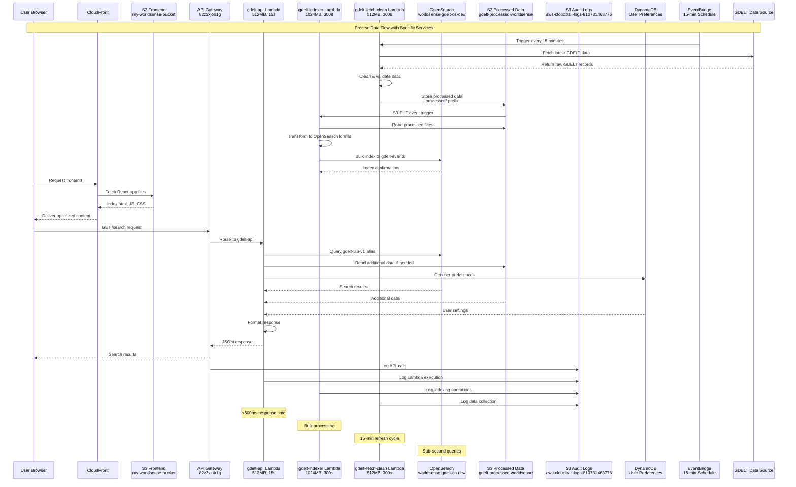

# Precise System Architecture Diagram

## System Architecture Diagram - Precise Version

```mermaid
graph TB
    subgraph "Frontend Services"
        A[CloudFront CDN<br/>d7hwjrg2pdpoj.cloudfront.net] --> B[S3 Frontend Bucket<br/>my-worldsense-bucket<br/>Static Website Hosting]
    end
    
    subgraph "API Gateway Services"
        C[API Gateway HTTP API<br/>82z3xjob1g] --> D[API Gateway REST API<br/>sqeg4ixx58<br/>Backup]
    end
    
    subgraph "Lambda Functions"
        E[gdelt-api Lambda<br/>512MB, 15s<br/>Main API Processing] --> F[gdelt-indexer Lambda<br/>1024MB, 300s<br/>Data Indexing]
        F --> G[gdelt-fetch-clean Lambda<br/>512MB, 300s<br/>Data Collection]
    end
    
    subgraph "Data Storage Services"
        H[OpenSearch Service<br/>worldsense-gdelt-os-dev<br/>Search Engine] --> I[S3 Processed Data Bucket<br/>gdelt-processed-worldsense<br/>Data Lake]
        I --> J[S3 Audit Logs Bucket<br/>aws-cloudtrail-logs-810731468776<br/>Log Storage]
        K[DynamoDB<br/>User Preferences Storage]
    end
    
    subgraph "Security Services"
        L[Cognito User Pool<br/>worldsense-users<br/>Authentication] --> M[IAM Cross-Account Roles<br/>Project-Admin/Developer/Viewer]
        M --> N[Secrets Manager<br/>opensearch/worldsense/indexer<br/>Credential Storage]
    end
    
    subgraph "Event & Messaging Services"
        O[EventBridge<br/>GDELTFetchEvery15min<br/>Scheduled Triggers] --> P[SNS<br/>Notifications]
        P --> Q[SQS<br/>Message Queues]
    end
    
    subgraph "Monitoring & Networking"
        R[CloudWatch<br/>Logs & Metrics] --> S[CloudTrail<br/>API Audit Logs]
        S --> T[VPC<br/>vpc-017bc7b7189ac581e<br/>Network Isolation]
    end
    
    %% Frontend to API connections
    A --> C
    
    %% API to Lambda connections
    C --> E
    
    %% Lambda to Data connections
    E --> H
    E --> I
    E --> K
    F --> H
    F --> I
    G --> I
    
    %% Event processing connections
    O --> G
    
    %% Security connections
    L --> A
    M --> E
    M --> F
    M --> G
    M --> H
    M --> I
    N --> E
    N --> F
    N --> G
    
    %% Monitoring connections
    R --> E
    R --> F
    R --> G
    S --> E
    S --> F
    S --> G
    T --> E
    T --> F
    T --> G
    T --> H
    
    style A fill:#e3f2fd
    style B fill:#e1f5fe
    style C fill:#f3e5f5
    style D fill:#f3e5f5
    style E fill:#e8f5e8
    style F fill:#e8f5e8
    style G fill:#e8f5e8
    style H fill:#fff3e0
    style I fill:#fce4ec
    style J fill:#fce4ec
    style K fill:#fce4ec
    style L fill:#f1f8e9
    style M fill:#fff3e0
    style N fill:#f1f8e9
    style O fill:#fff8e1
    style P fill:#fff8e1
    style Q fill:#fff8e1
    style R fill:#f1f8e9
    style S fill:#f1f8e9
    style T fill:#e8f5e8
```

## System Architecture Diagram - Ultra-Precise Version

```mermaid
graph TB
    subgraph "Frontend Layer"
        A[CloudFront CDN<br/>d7hwjrg2pdpoj.cloudfront.net] --> B[S3 Frontend<br/>my-worldsense-bucket<br/>React App Hosting]
    end
    
    subgraph "API Layer"
        C[HTTP API Gateway<br/>82z3xjob1g<br/>/search, /map, /stats] --> D[REST API Gateway<br/>sqeg4ixx58<br/>Backup Routes]
    end
    
    subgraph "Lambda Functions - Specific Roles"
        E[gdelt-api<br/>512MB, 15s<br/>→ OpenSearch Queries<br/>→ S3 Data Reads<br/>→ DynamoDB User Prefs]
        F[gdelt-indexer<br/>1024MB, 300s<br/>→ S3 Data Processing<br/>→ OpenSearch Indexing<br/>→ Bulk Data Operations]
        G[gdelt-fetch-clean<br/>512MB, 300s<br/>→ GDELT Data Fetch<br/>→ S3 Data Storage<br/>→ Data Cleaning]
    end
    
    subgraph "Data Layer - Specific Purposes"
        H[OpenSearch<br/>worldsense-gdelt-os-dev<br/>gdelt-events index<br/>gdelt-lab-v1 alias]
        I[S3 Processed Data<br/>gdelt-processed-worldsense<br/>GDELT Processed Files<br/>processed/ prefix]
        J[S3 Audit Logs<br/>aws-cloudtrail-logs-810731468776<br/>API Call Logs<br/>Security Events]
        K[DynamoDB<br/>User Preferences<br/>Dashboard Settings<br/>Search History]
    end
    
    subgraph "Security Layer"
        L[Cognito<br/>worldsense-users<br/>User Authentication<br/>JWT Tokens] --> M[IAM Roles<br/>Cross-Account Access<br/>5 External Accounts]
        M --> N[Secrets Manager<br/>OpenSearch Credentials<br/>Auto Rotation]
    end
    
    subgraph "Event Processing"
        O[EventBridge<br/>15-min Schedule<br/>GDELT Data Fetch] --> G
        P[SNS<br/>Notifications<br/>Error Alerts] --> Q[SQS<br/>Message Queues<br/>Dead Letter Queue]
    end
    
    subgraph "Monitoring & Network"
        R[CloudWatch<br/>Lambda Logs<br/>Performance Metrics] --> S[CloudTrail<br/>API Audit Trail<br/>Security Logging]
        S --> T[VPC<br/>Private Subnets<br/>Security Groups]
    end
    
    %% Precise connections
    A --> C
    C --> E
    E --> H
    E --> I
    E --> K
    F --> H
    F --> I
    O --> G
    G --> I
    L --> A
    M --> E
    M --> F
    M --> G
    N --> E
    N --> F
    N --> G
    R --> E
    R --> F
    R --> G
    T --> E
    T --> F
    T --> G
    T --> H
    
    style A fill:#e3f2fd
    style B fill:#e1f5fe
    style C fill:#f3e5f5
    style D fill:#f3e5f5
    style E fill:#e8f5e8
    style F fill:#e8f5e8
    style G fill:#e8f5e8
    style H fill:#fff3e0
    style I fill:#fce4ec
    style J fill:#fce4ec
    style K fill:#fce4ec
    style L fill:#f1f8e9
    style M fill:#fff3e0
    style N fill:#f1f8e9
    style O fill:#fff8e1
    style P fill:#fff8e1
    style Q fill:#fff8e1
    style R fill:#f1f8e9
    style S fill:#f1f8e9
    style T fill:#e8f5e8
```

## Data Flow Diagram - Precise Connections

```mermaid
sequenceDiagram
    participant U as User Browser
    participant CF as CloudFront
    participant SF as S3 Frontend<br/>my-worldsense-bucket
    participant AG as API Gateway<br/>82z3xjob1g
    participant LA as gdelt-api Lambda<br/>512MB, 15s
    participant LI as gdelt-indexer Lambda<br/>1024MB, 300s
    participant LF as gdelt-fetch-clean Lambda<br/>512MB, 300s
    participant OS as OpenSearch<br/>worldsense-gdelt-os-dev
    participant SD as S3 Processed Data<br/>gdelt-processed-worldsense
    participant SL as S3 Audit Logs<br/>aws-cloudtrail-logs-810731468776
    participant DB as DynamoDB<br/>User Preferences
    participant EB as EventBridge<br/>15-min Schedule
    participant GDELT as GDELT Data Source
    
    Note over U,GDELT: Precise Data Flow with Specific Services
    
    %% Data Collection Flow
    EB->>LF: Trigger every 15 minutes
    LF->>GDELT: Fetch latest GDELT data
    GDELT-->>LF: Return raw GDELT records
    LF->>LF: Clean & validate data
    LF->>SD: Store processed data<br/>processed/ prefix
    
    %% Data Indexing Flow
    SD->>LI: S3 PUT event trigger
    LI->>SD: Read processed files
    LI->>LI: Transform to OpenSearch format
    LI->>OS: Bulk index to gdelt-events
    OS-->>LI: Index confirmation
    
    %% User Request Flow
    U->>CF: Request frontend
    CF->>SF: Fetch React app files
    SF-->>CF: index.html, JS, CSS
    CF-->>U: Deliver optimized content
    
    %% API Processing Flow
    U->>AG: GET /search request
    AG->>LA: Route to gdelt-api
    LA->>OS: Query gdelt-lab-v1 alias
    LA->>SD: Read additional data if needed
    LA->>DB: Get user preferences
    OS-->>LA: Search results
    SD-->>LA: Additional data
    DB-->>LA: User settings
    LA->>LA: Format response
    LA-->>AG: JSON response
    AG-->>U: Search results
    
    %% Audit Logging
    AG->>SL: Log API calls
    LA->>SL: Log Lambda execution
    LI->>SL: Log indexing operations
    LF->>SL: Log data collection
    
    Note over LA: <500ms response time
    Note over LI: Bulk processing
    Note over LF: 15-min refresh cycle
    Note over OS: Sub-second queries
```

