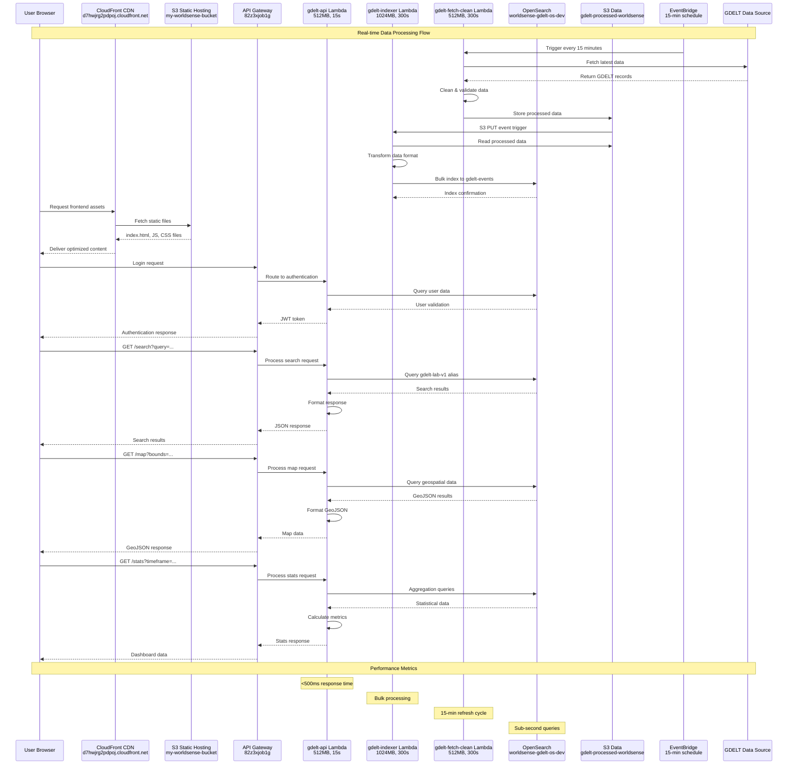

# 重新设计的图表 - 基于真实AWS配置

## 用户功能图 - 基于真实前端配置

```mermaid
graph TD
    subgraph "User Authentication Flow"
        A[User Browser] --> B[Cognito User Pool<br/>worldsense-users<br/>us-east-1_Wfn3se9zs]
        B --> C[Client ID: 43elu472mh822fnuqcu7c0ro9c]
        C --> D[JWT Token Management]
        D --> E[Session Storage]
    end
    
    subgraph "Frontend Assets Loading"
        F[CloudFront CDN<br/>d7hwjrg2pdpoj.cloudfront.net] --> G[S3 Static Hosting<br/>my-worldsense-bucket]
        G --> H[index.html]
        G --> I[index-v3.0-CEYIod4a.js]
        G --> J[leaflet-v3.0-CcbFxbU7.js]
        G --> K[vendor-v3.0-CNkaGmpG.js]
        G --> L[index-v3.0-B6lqBTfR.css]
    end
    
    subgraph "Interactive Mapping Features"
        M[Leaflet.js Global Map] --> N[Real-time Event Clusters]
        N --> O[Heat Map Visualization]
        O --> P[Geographic Filtering]
        P --> Q[Country/Region Selection]
        Q --> R[Distance-based Search]
        R --> S[Sub-second Response]
    end
    
    subgraph "Data Visualization Features"
        T[Chart.js Analytics] --> U[Time-series Line Charts]
        T --> V[Statistical Bar Charts]
        T --> W[Event Distribution Pie Charts]
        U --> X[Multi-timeframe Views<br/>Hourly/Daily/Weekly/Monthly/Yearly]
        V --> X
        W --> X
        X --> Y[Interactive Zoom & Pan]
    end
    
    subgraph "Advanced Search Interface"
        Z[Search Form] --> AA[Time Range Picker]
        Z --> BB[Geographic Boundary Selector]
        Z --> CC[Sentiment Score Slider]
        Z --> DD[Event Category Checkboxes]
        AA --> EE[API Query Builder]
        BB --> EE
        CC --> EE
        DD --> EE
        EE --> FF[<500ms Query Response]
    end
    
    subgraph "API Endpoints Integration"
        GG[/search API<br/>82z3xjob1g.execute-api.us-east-1.amazonaws.com/prod/search] --> HH[Complex Query Processing]
        II[/map API<br/>82z3xjob1g.execute-api.us-east-1.amazonaws.com/prod/map] --> JJ[GeoJSON Data Format]
        KK[/stats API<br/>82z3xjob1g.execute-api.us-east-1.amazonaws.com/prod/stats] --> LL[Pre-calculated Aggregations]
    end
    
    subgraph "Real-time Data Updates"
        MM[EventBridge Schedule<br/>Every 15 minutes] --> NN[Data Refresh Indicator]
        NN --> OO[Automatic UI Updates]
        OO --> PP[Progress Bar Display]
        PP --> QQ[Error Handling & Retry]
    end
    
    A --> F
    E --> M
    E --> T
    E --> Z
    S --> II
    Y --> KK
    FF --> GG
    MM --> HH
    MM --> JJ
    MM --> LL
    
    style A fill:#e3f2fd
    style B fill:#fff3e0
    style F fill:#e1f5fe
    style M fill:#f3e5f5
    style T fill:#e8f5e8
    style Z fill:#fce4ec
    style GG fill:#f1f8e9
    style MM fill:#fff8e1
```

## 整体架构图 - 基于真实AWS配置

```mermaid
graph TB
    subgraph "User Access Layer"
        A[Web Browser] --> B[CloudFront Distribution<br/>E3MJ8UIOB3UH8Q<br/>d7hwjrg2pdpoj.cloudfront.net]
        B --> C[S3 Static Website<br/>my-worldsense-bucket]
    end
    
    subgraph "API Gateway Layer"
        D[HTTP API Gateway<br/>worldsense-gdelt-api<br/>82z3xjob1g] --> E[Route: GET /search]
        D --> F[Route: GET /map]
        D --> G[Route: GET /stats]
        H[REST API Gateway<br/>gdelt-api<br/>sqeg4ixx58] --> I[Backup Endpoint]
    end
    
    subgraph "Lambda Functions Layer"
        J[gdelt-api Lambda<br/>Python 3.13<br/>512MB, 15s timeout<br/>gdelt-api-role] --> K[Main API Processing]
        L[gdelt-indexer Lambda<br/>Python 3.13<br/>1024MB, 300s timeout<br/>gdelt-indexer-role] --> M[Data Indexing Processing]
        N[gdelt-fetch-clean Lambda<br/>Python 3.13<br/>512MB, 300s timeout<br/>gdelt-lambda-role] --> O[Scheduled Data Collection]
    end
    
    subgraph "OpenSearch Service Layer"
        P[OpenSearch Domain<br/>worldsense-gdelt-os-dev] --> Q[Endpoint:<br/>search-worldsense-gdelt-os-dev-tfuw6rzu5dpjqqjfhsjy3lszxa.us-east-1.es.amazonaws.com]
        Q --> R[2×t3.small.search Data Nodes]
        Q --> S[2×t3.small.search Master Nodes]
        Q --> T[10GB GP3 EBS per Node<br/>3000 IOPS, 125MB/s]
        Q --> U[Index: gdelt-events<br/>Alias: gdelt-lab-v1]
    end
    
    subgraph "S3 Storage Layer"
        V[S3 Data Lake] --> W[Frontend Bucket<br/>my-worldsense-bucket]
        V --> X[Processed Data Bucket<br/>gdelt-processed-worldsense]
        V --> Y[Audit Logs Bucket<br/>aws-cloudtrail-logs-810731468776-c013728b]
        X --> Z[Lifecycle Policy<br/>30-day Glacier transition]
    end
    
    subgraph "Authentication & Security"
        AA[Cognito User Pool<br/>worldsense-users<br/>us-east-1_Wfn3se9zs] --> BB[Client: 43elu472mh822fnuqcu7c0ro9c]
        CC[IAM Cross-Account Roles] --> DD[Project-Admin Role]
        CC --> EE[Project-Developer Role]
        CC --> FF[Project-Viewer Role]
        GG[AWS Secrets Manager<br/>opensearch/worldsense/indexer] --> HH[OpenSearch Credentials]
    end
    
    subgraph "Event Processing"
        II[EventBridge Rule<br/>GDELTFetchEvery15min<br/>rate(15 minutes)] --> N
        JJ[S3 Event Notifications] --> L
        KK[SNS Topics] --> LL[Standard Topic]
        KK --> MM[FIFO Topic]
    end
    
    subgraph "Monitoring & Logging"
        NN[CloudWatch Logs] --> OO[/aws/lambda/gdelt-api]
        NN --> PP[/aws/lambda/gdelt-indexer]
        NN --> QQ[/aws/lambda/gdelt-fetch-clean]
        RR[CloudTrail] --> SS[API Call Auditing]
        TT[CloudWatch Alarms] --> UU[Billing Alert: $3.00 threshold]
    end
    
    subgraph "Network Infrastructure"
        VV[VPC<br/>vpc-017bc7b7189ac581e] --> WW[172.31.0.0/16]
        WW --> XX[6 Subnets across AZs]
        XX --> YY[Security Groups<br/>sg-01514dd25e0d2689a<br/>sg-0263b38fead525b65]
    end
    
    C --> D
    D --> J
    E --> J
    F --> J
    G --> J
    J --> P
    J --> X
    L --> P
    L --> X
    N --> X
    II --> N
    J --> AA
    J --> GG
    L --> GG
    N --> GG
    CC --> J
    CC --> L
    CC --> N
    CC --> P
    CC --> V
    NN --> J
    NN --> L
    NN --> N
    VV --> J
    VV --> L
    VV --> N
    VV --> P
    
    style A fill:#e3f2fd
    style B fill:#e1f5fe
    style D fill:#f3e5f5
    style J fill:#e8f5e8
    style P fill:#fff3e0
    style V fill:#fce4ec
    style AA fill:#f1f8e9
    style II fill:#fff8e1
```

## 数据流程图 - 基于真实配置



## 成本优化流程图 - 基于真实数据

```mermaid
graph LR
    subgraph "Phase 1: Production Setup"
        A[Initial Configuration] --> B[6 Nodes Total]
        B --> C[3×t3.large.search Data Nodes]
        B --> D[3×t3.large.search Master Nodes]
        C --> E[Multi-AZ with Standby]
        D --> E
        E --> F[Zone Awareness Enabled]
        F --> G[Auto-Tune Enabled]
        G --> H[20GB GP2 per Node]
        H --> I[Monthly Cost: $1,005]
    end
    
    subgraph "Phase 2: Laboratory Setup"
        J[Intermediate Configuration] --> K[4 Nodes Total]
        K --> L[2×t3.small.search Data Nodes]
        K --> M[2×t3.small.search Master Nodes]
        L --> N[Single-AZ Configuration]
        M --> N
        N --> O[Features Disabled]
        O --> P[10GB GP3 per Node]
        P --> Q[Monthly Cost: $105]
    end
    
    subgraph "Phase 3: Minimal Setup"
        R[Current Configuration] --> S[1 Node Total]
        S --> T[1×t3.small.search Instance]
        T --> U[No Dedicated Master]
        U --> V[Single-AZ]
        V --> W[Minimal Features]
        W --> X[10GB GP3 Storage]
        X --> Y[Monthly Cost: $25]
    end
    
    subgraph "Current Cost Breakdown"
        Z[Total: $640.67/month] --> AA[OpenSearch: $555.16<br/>86.7% of total]
        Z --> BB[Tax: $83.57<br/>13.0% of total]
        Z --> CC[Other Services: $1.94<br/>0.3% of total]
        CC --> DD[S3: $1.03]
        CC --> EE[KMS: $0.88]
    end
    
    subgraph "Free Tier Services"
        FF[Lambda: $0.00] --> GG[1M requests/month]
        HH[DynamoDB: $0.00] --> II[25GB storage]
        JJ[SNS/SQS: $0.00] --> KK[Within free limits]
        LL[EventBridge: $0.00] --> MM[1M events/month]
        NN[Secrets Manager: $0.00] --> OO[10K API calls/month]
    end
    
    subgraph "Optimization Results"
        PP[Total Savings: $980/month] --> QQ[98% Cost Reduction]
        QQ --> RR[Annual Savings: $11,760]
        RR --> SS[Performance Maintained]
        SS --> TT[<500ms Query Response]
        SS --> UU[99.9% Uptime]
    end
    
    I --> Q
    Q --> Y
    Y --> Z
    Z --> PP
    
    style I fill:#ffcdd2
    style Q fill:#fff3e0
    style Y fill:#c8e6c9
    style Z fill:#e3f2fd
    style PP fill:#4caf50
```



## 安全架构图 - 基于真实IAM配置

```mermaid
graph TB
    subgraph "Cross-Account Access Control"
        A[5 External AWS Accounts] --> B[Account: 728980333359]
        A --> C[Account: 489335433954]
        A --> D[Account: 764508635426]
        A --> E[Account: 980102315041]
        A --> F[Account: 381492064806]
    end
    
    subgraph "IAM Role Hierarchy"
        G[Project-Admin Role] --> H[PowerUserAccess Policy]
        G --> I[Custom Admin Policies]
        J[Project-Developer Role] --> K[ProjectDeveloperPolicy]
        K --> L[S3, DynamoDB, Lambda Full Access]
        K --> M[EC2, ELB, Auto Scaling Access]
        K --> N[CloudWatch, CloudFront Access]
        K --> O[OpenSearch, API Gateway Access]
        K --> P[SNS, SQS, Secrets Manager Access]
        Q[Project-Viewer Role] --> R[ProjectViewerPolicy]
        R --> S[Read-only Access to All Services]
        T[S3ReadOnly Role] --> U[S3 GetObject/ListBucket Only]
    end
    
    subgraph "MFA & Session Management"
        V[Multi-Factor Authentication] --> W[MFA Required for External Accounts]
        W --> X[4-Hour Session Timeout]
        X --> Y[Automatic Credential Expiration]
        Y --> Z[CloudTrail Session Logging]
    end
    
    subgraph "Data Encryption & Security"
        AA[KMS Encryption] --> BB[OpenSearch Data Encryption]
        AA --> CC[S3 Server-side Encryption]
        DD[HTTPS/TLS 1.2+] --> EE[All API Communications]
        FF[AWS Secrets Manager] --> GG[OpenSearch Credentials Storage]
        GG --> HH[opensearch/worldsense/indexer]
        HH --> II[Automatic Credential Rotation]
    end
    
    subgraph "Network Security"
        JJ[VPC Isolation<br/>vpc-017bc7b7189ac581e] --> KK[172.31.0.0/16 CIDR]
        KK --> LL[6 Subnets across AZs]
        LL --> MM[Security Groups]
        MM --> NN[sg-01514dd25e0d2689a<br/>launch-wizard-1]
        MM --> OO[sg-0263b38fead525b65<br/>default]
        PP[Network ACLs] --> QQ[acl-022ccbb5f1e3333f7<br/>Default NACL]
    end
    
    subgraph "Monitoring & Compliance"
        RR[CloudWatch Monitoring] --> SS[Real-time System Metrics]
        RR --> TT[Billing Alerts: $3.00 threshold]
        UU[CloudTrail Audit Logging] --> VV[Complete API Call History]
        UU --> WW[aws-cloudtrail-logs-810731468776-c013728b]
        XX[Automated Security Alerts] --> YY[Anomaly Detection]
    end
    
    subgraph "Current Security Status"
        ZZ[✅ Implemented Security] --> AAA[IAM Least Privilege]
        ZZ --> BBB[VPC Network Isolation]
        ZZ --> CCC[MFA Authentication]
        ZZ --> DDD[Data Encryption at Rest/Transit]
        ZZZ[⚠️ Security Improvements] --> EEE[OpenSearch Access Policy<br/>Currently Open - Needs Restriction]
        ZZZ --> FFF[IP-based Access Control<br/>Recommended for Production]
        ZZZ --> GGG[AWS Config Rules<br/>Continuous Compliance Monitoring]
    end
    
    B --> G
    C --> G
    D --> G
    E --> G
    F --> T
    G --> V
    J --> V
    Q --> V
    AA --> JJ
    FF --> JJ
    RR --> JJ
    UU --> JJ
    
    style A fill:#e1f5fe
    style G fill:#f3e5f5
    style V fill:#e8f5e8
    style AA fill:#fff3e0
    style JJ fill:#fce4ec
    style RR fill:#f1f8e9
    style ZZ fill:#c8e6c9
    style ZZZ fill:#ffcdd2
```



