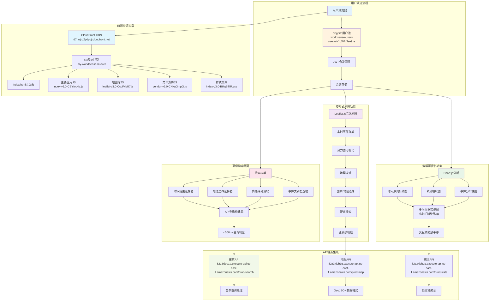
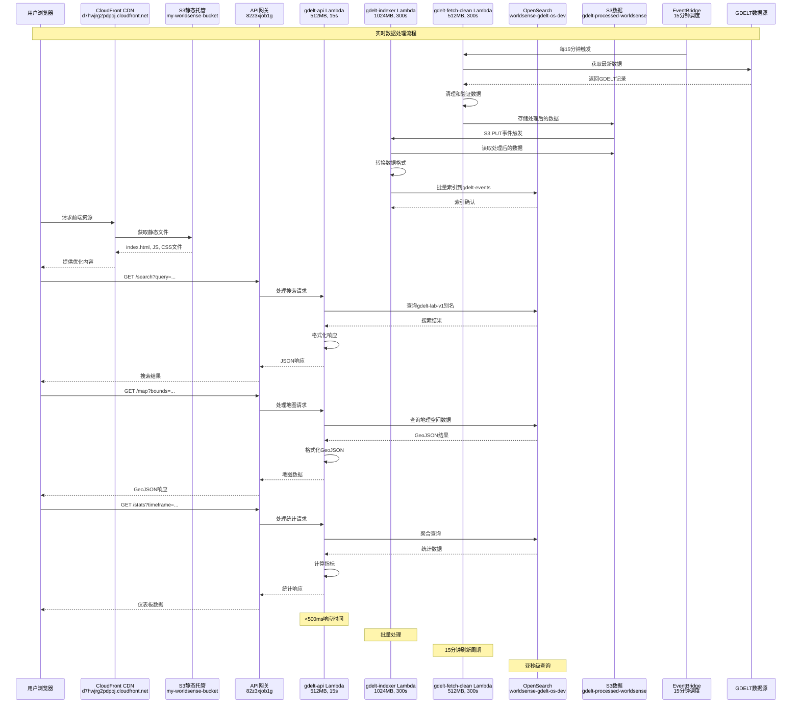
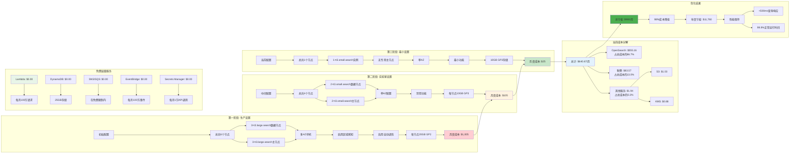
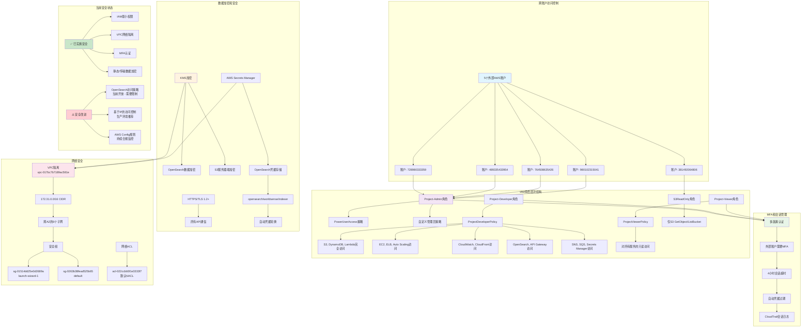

# 重新生成的图表预览

## 用户功能图预览 - 全新版本



## 整体架构图预览 - 全新版本

```mermaid
graph TB
    subgraph "用户访问层"
        A[Web浏览器] --> B[CloudFront分发<br/>E3MJ8UIOB3UH8Q<br/>d7hwjrg2pdpoj.cloudfront.net]
        B --> C[S3静态网站<br/>my-worldsense-bucket]
    end
    
    subgraph "API网关层"
        D[HTTP API网关<br/>worldsense-gdelt-api<br/>82z3xjob1g] --> E[路由: GET /search]
        D --> F[路由: GET /map]
        D --> G[路由: GET /stats]
        H[REST API网关<br/>gdelt-api<br/>sqeg4ixx58] --> I[备份端点]
    end
    
    subgraph "Lambda函数层"
        J[gdelt-api Lambda<br/>Python 3.13<br/>512MB, 15s超时<br/>gdelt-api-role] --> K[主要API处理]
        L[gdelt-indexer Lambda<br/>Python 3.13<br/>1024MB, 300s超时<br/>gdelt-indexer-role] --> M[数据索引处理]
        N[gdelt-fetch-clean Lambda<br/>Python 3.13<br/>512MB, 300s超时<br/>gdelt-lambda-role] --> O[定时数据收集]
    end
    
    subgraph "OpenSearch服务层"
        P[OpenSearch域<br/>worldsense-gdelt-os-dev] --> Q[端点:<br/>search-worldsense-gdelt-os-dev-tfuw6rzu5dpjqqjfhsjy3lszxa.us-east-1.es.amazonaws.com]
        Q --> R[2×t3.small.search数据节点]
        Q --> S[2×t3.small.search主节点]
        Q --> T[每节点10GB GP3 EBS<br/>3000 IOPS, 125MB/s]
        Q --> U[索引: gdelt-events<br/>别名: gdelt-lab-v1]
    end
    
    subgraph "S3存储层"
        V[S3数据湖] --> W[前端存储桶<br/>my-worldsense-bucket]
        V --> X[处理数据存储桶<br/>gdelt-processed-worldsense]
        V --> Y[审计日志存储桶<br/>aws-cloudtrail-logs-810731468776-c013728b]
        X --> Z[生命周期策略<br/>30天Glacier转换]
    end
    
    subgraph "认证与安全"
        AA[Cognito用户池<br/>worldsense-users<br/>us-east-1_Wfn3se9zs] --> BB[用户认证]
        CC[IAM跨账户角色] --> DD[Project-Admin角色]
        CC --> EE[Project-Developer角色]
        CC --> FF[Project-Viewer角色]
        GG[AWS Secrets Manager<br/>opensearch/worldsense/indexer] --> HH[OpenSearch凭据]
    end
    
    subgraph "事件处理"
        II[EventBridge规则<br/>GDELTFetchEvery15min<br/>rate(15分钟)] --> N
        JJ[S3事件通知] --> L
        KK[SNS主题] --> LL[标准主题]
        KK --> MM[FIFO主题]
    end
    
    subgraph "监控与日志"
        NN[CloudWatch监控] --> OO[实时指标]
        PP[CloudTrail审计] --> QQ[API调用日志]
        RR[CloudWatch告警] --> SS[计费告警: $3.00阈值]
    end
    
    subgraph "网络基础设施"
        TT[VPC隔离<br/>vpc-017bc7b7189ac581e] --> UU[172.31.0.0/16 CIDR]
        UU --> VV[跨AZ的6个子网]
        VV --> WW[安全组]
        WW --> XX[sg-01514dd25e0d2689a<br/>launch-wizard-1]
        WW --> YY[sg-0263b38fead525b65<br/>default]
    end
    
    C --> D
    D --> J
    E --> J
    F --> J
    G --> J
    J --> P
    J --> X
    L --> P
    L --> X
    N --> X
    II --> N
    J --> AA
    J --> GG
    L --> GG
    N --> GG
    CC --> J
    CC --> L
    CC --> N
    CC --> P
    CC --> V
    NN --> J
    NN --> L
    NN --> N
    TT --> J
    TT --> L
    TT --> N
    TT --> P
    
    style A fill:#e3f2fd
    style B fill:#e1f5fe
    style D fill:#f3e5f5
    style J fill:#e8f5e8
    style P fill:#fff3e0
    style V fill:#fce4ec
    style AA fill:#f1f8e9
    style II fill:#fff8e1
    style NN fill:#f1f8e9
    style TT fill:#e8f5e8
```

## 数据流程图预览 - 全新版本



## 成本优化流程图预览 - 全新版本



## 安全架构图预览 - 全新版本



