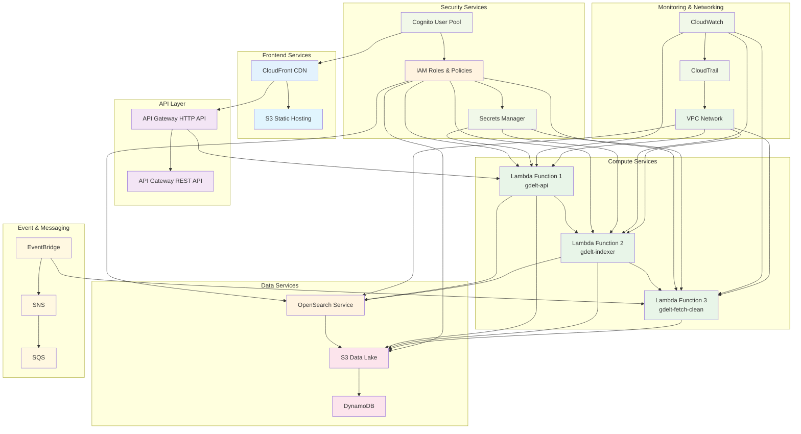
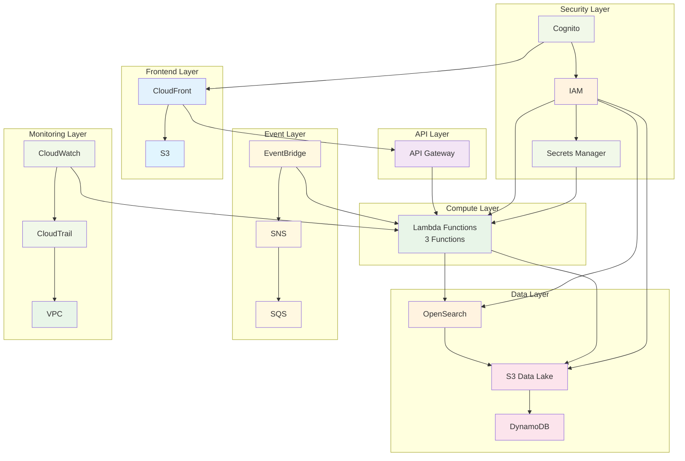
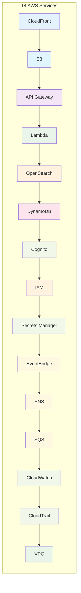

# Simplified System Architecture Diagram - 14 AWS Services

## System Architecture Diagram - Simplified Version

## System Architecture Diagram - Ultra-Simplified Version

## System Architecture Diagram - Service Overview Only

