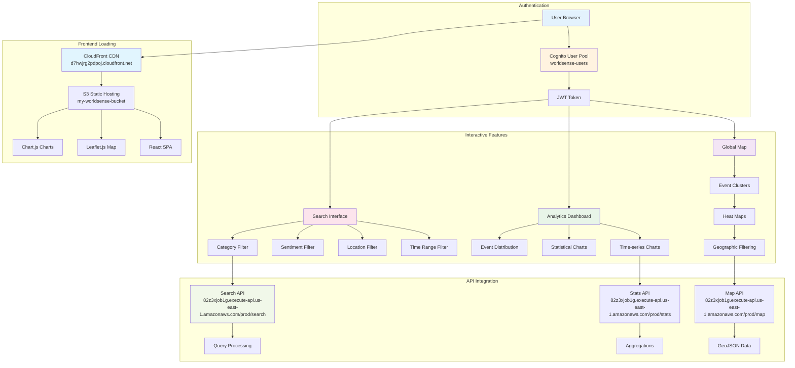
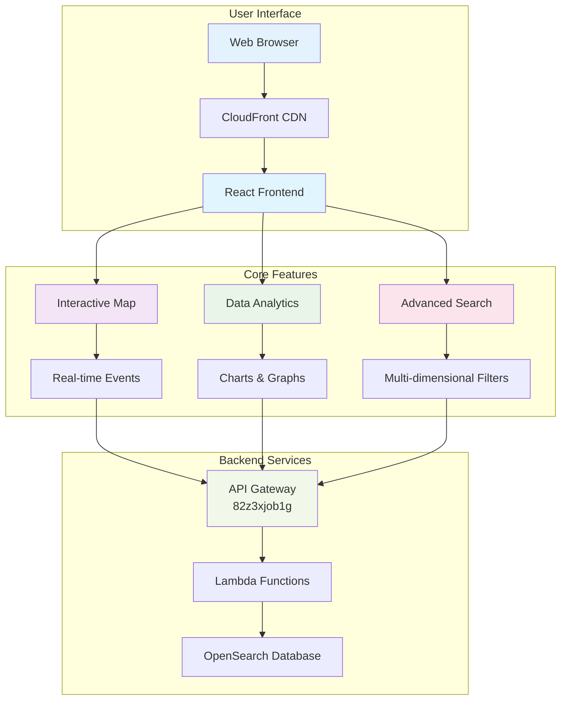
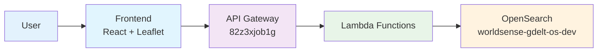
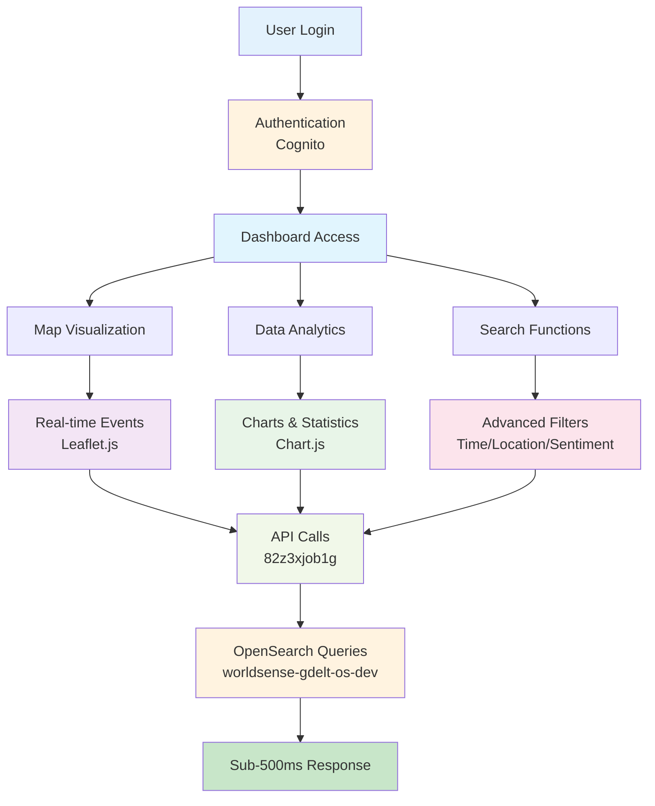

# Simplified User Features Diagram - English Version

## User Features Diagram Preview - Simplified Version

## Ultra-Simplified Version for Presentations

## Minimal Version for Quick Overview

## Feature Flow Diagram

