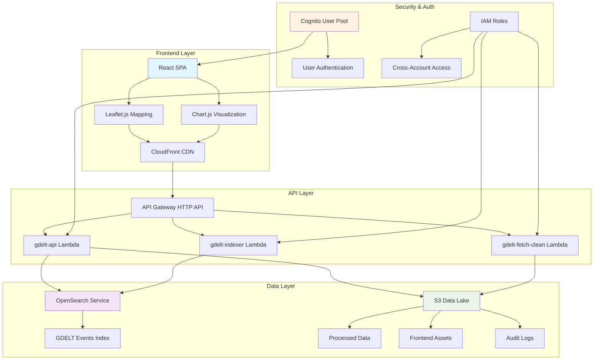

# Slide 1: Project Overview - System Architecture

## WorldSense-GDELT Platform Architecture

## Key Components Overview

- **Frontend**: React SPA with Leaflet.js mapping
- **Backend**: 3 Lambda functions (Python 3.13)
- **Data**: OpenSearch + S3 data lake
- **API**: API Gateway HTTP API v2.0
- **Live Demo**: https://d7hwjrg2pdpoj.cloudfront.net

