# Slide 2: Team Collaboration - Workflow Diagram

## 5-Member Team Collaboration Structure

```mermaid
graph TD
    subgraph "Team Members & Roles"
        A[Maxing<br/>Project Overview] --> B[Xiaoyi Yu<br/>Project Manager & DevOps]
        B --> C[Zhaoxuan Chen<br/>Backend Developer]
        C --> D[Yang Liu<br/>Data Analyst & QA]
        D --> E[Zhiyuan Wei<br/>Frontend Developer]
        E --> F[Xiang Ma<br/>Security Specialist]
    end
    
    subgraph "Key Achievements"
        B --> G[77.4% Cost Reduction]
        C --> H[Real-time 15-min Processing]
        E --> I[<2s Page Load Time]
        F --> J[5 External Accounts + MFA]
        D --> K[95% Test Coverage<br/>$1,061→$240 Savings]
    end
    
    subgraph "Cross-Account Collaboration"
        L[5 External AWS Accounts] --> M[3-Tier IAM Roles]
        M --> N[Admin/Developer/Viewer]
        N --> O[4-Hour Session Timeout]
        O --> P[MFA Required]
    end
    
    subgraph "Collaboration Flow"
        Q[Project Planning] --> R[Development Sprint]
        R --> S[Code Review]
        S --> T[Testing & QA]
        T --> U[Deployment]
        U --> V[Monitoring]
        V --> Q
    end
    
    style B fill:#e3f2fd
    style C fill:#e8f5e8
    style D fill:#fff3e0
    style E fill:#f3e5f5
    style F fill:#fce4ec
```

## Team Collaboration Metrics

- **5 External AWS Accounts**: 728980333359, 489335433954, 764508635426, 980102315041, 381492064806
- **3-Tier IAM Roles**: Admin, Developer, Viewer
- **MFA Required**: All external accounts except S3 read-only
- **Session Management**: 4-hour maximum timeout

