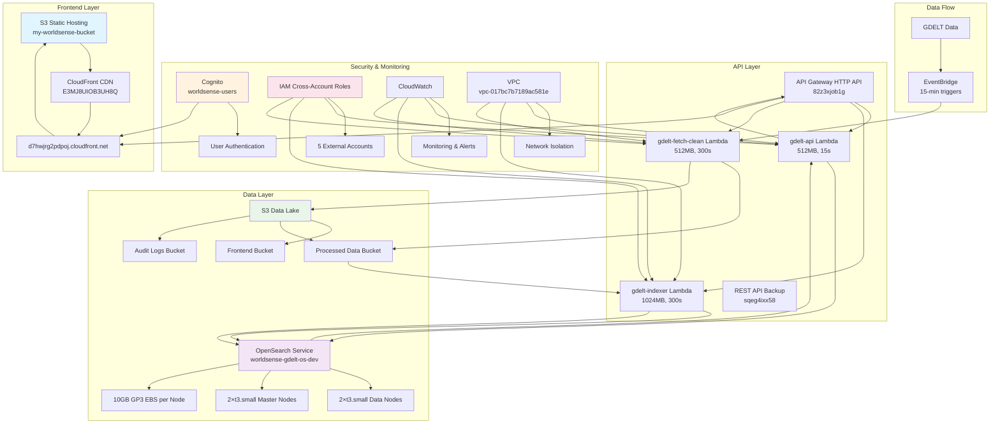

# Slide 3: System Architecture - Detailed Design

## 14 AWS Services Integration Architecture

## Architecture Components Details

### Frontend Layer
- **S3**: Static website hosting
- **CloudFront**: Global CDN distribution

### API Layer
- **API Gateway**: HTTP API v2.0 + REST API backup
- **Lambda Functions**: 3 specialized functions with different configurations

### Data Layer
- **OpenSearch**: Cost-optimized cluster with 4 nodes total
- **S3**: 3-bucket data lake architecture

### Security & Monitoring
- **Cognito**: User authentication
- **IAM**: Cross-account collaboration
- **CloudWatch**: Comprehensive monitoring
- **VPC**: Network isolation

