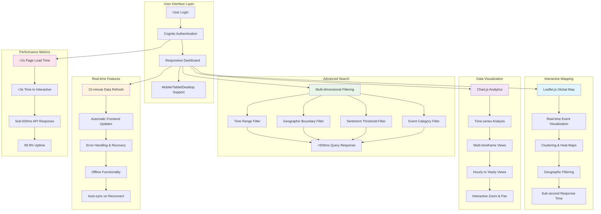

# Slide 4: Core User Features - Function Flow Diagram

## Interactive Platform Capabilities

## User Experience Flow

### Authentication & Access
1. **User Login**: Cognito email/password authentication
2. **Session Management**: JWT token-based sessions
3. **Responsive Design**: Adaptive layouts for all devices

### Core Functionality
1. **Interactive Mapping**: Leaflet.js with real-time data
2. **Data Visualization**: Chart.js time-series analysis
3. **Advanced Search**: Multi-dimensional filtering
4. **Real-time Updates**: 15-minute refresh cycles

### Performance Features
- **Page Load**: <2 seconds
- **API Response**: <500 milliseconds
- **Offline Support**: Core functionality available offline
- **Auto-sync**: Data synchronization on reconnection

