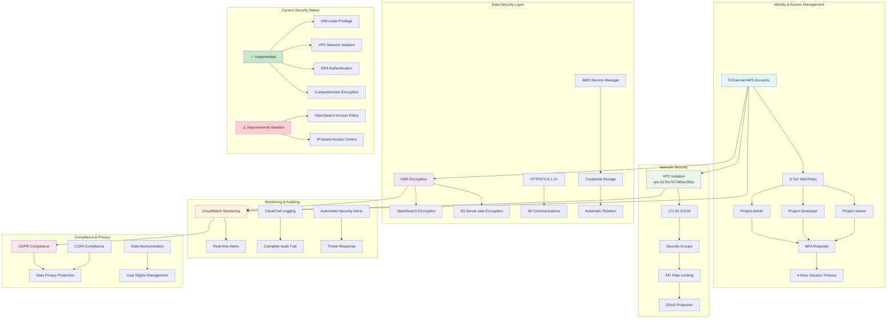

# Slide 5: Security Design - Multi-layer Security Framework

## Comprehensive Security Architecture

## Security Implementation Details

### Cross-Account Access Control
- **5 External Accounts**: 728980333359, 489335433954, 764508635426, 980102315041, 381492064806
- **3-Tier IAM Roles**: Admin (full access), Developer (development permissions), Viewer (read-only)
- **MFA Enforcement**: Mandatory for all external accounts
- **Session Management**: 4-hour maximum timeout

### Data Protection
- **Encryption**: KMS for OpenSearch, SSE-S3 for storage
- **Transmission**: HTTPS/TLS 1.2+ for all communications
- **Secrets Management**: AWS Secrets Manager with automatic rotation

### Network Security
- **VPC Isolation**: Default VPC with 6 subnets across availability zones
- **Security Groups**: Controlled network access
- **API Protection**: Rate limiting and DDoS protection

### Monitoring & Compliance
- **Real-time Monitoring**: CloudWatch alerts and metrics
- **Audit Logging**: Complete CloudTrail audit trail
- **Compliance**: GDPR and CCPA compliance framework

