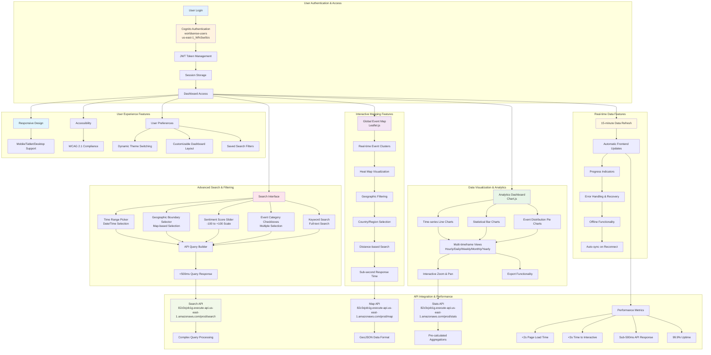

# System Architecture & Core User Features Diagrams

## System Architecture Diagram

```mermaid
graph TB
    subgraph "Frontend Layer"
        A[User Browser] --> B[CloudFront CDN<br/>d7hwjrg2pdpoj.cloudfront.net<br/>Distribution ID: E3MJ8UIOB3UH8Q]
        B --> C[S3 Static Website<br/>my-worldsense-bucket]
    end
    
    subgraph "API Gateway Layer"
        D[HTTP API Gateway<br/>worldsense-gdelt-api<br/>ID: 82z3xjob1g] --> E[Route: /search]
        D --> F[Route: /map]
        D --> G[Route: /stats]
        H[REST API Gateway<br/>gdelt-api<br/>ID: sqeg4ixx58] --> I[Backup Routes]
    end
    
    subgraph "Compute Layer"
        J[gdelt-api Lambda<br/>Python 3.13, 512MB, 15s<br/>Role: gdelt-api-role] --> K[API Processing]
        L[gdelt-indexer Lambda<br/>Python 3.13, 1024MB, 300s<br/>Role: gdelt-indexer-role] --> M[Data Indexing]
        N[gdelt-fetch-clean Lambda<br/>Python 3.13, 512MB, 300s<br/>Role: gdelt-lambda-role] --> O[Data Collection]
    end
    
    subgraph "Data Layer"
        P[OpenSearch Service<br/>worldsense-gdelt-os-dev<br/>Endpoint: search-worldsense-gdelt-os-dev-tfuw6rzu5dpjqqjfhsjy3lszxa.us-east-1.es.amazonaws.com] --> Q[2×t3.small.search Data Nodes]
        P --> R[2×t3.small.search Master Nodes]
        P --> S[10GB GP3 EBS per Node<br/>3000 IOPS, 125MB/s]
        P --> T[Index: gdelt-events<br/>Alias: gdelt-lab-v1]
        
        U[S3 Data Lake] --> V[Frontend Bucket<br/>my-worldsense-bucket]
        U --> W[Processed Data Bucket<br/>gdelt-processed-worldsense]
        U --> X[Audit Logs Bucket<br/>aws-cloudtrail-logs-810731468776-c013728b]
    end
    
    subgraph "Authentication & Security"
        Y[Cognito User Pool<br/>worldsense-users<br/>ID: us-east-1_Wfn3se9zs] --> Z[User Authentication]
        AA[IAM Cross-Account Roles] --> BB[Project-Admin Role]
        AA --> CC[Project-Developer Role]
        AA --> DD[Project-Viewer Role]
        EE[AWS Secrets Manager<br/>opensearch/worldsense/indexer] --> FF[OpenSearch Credentials]
    end
    
    subgraph "Event Processing"
        GG[EventBridge Rule<br/>GDELTFetchEvery15min<br/>rate(15 minutes)] --> N
        HH[S3 Event Notifications] --> L
        II[SNS Topics] --> JJ[Standard Topic]
        II --> KK[FIFO Topic]
    end
    
    subgraph "Monitoring & Networking"
        LL[CloudWatch Monitoring] --> MM[Logs & Metrics]
        NN[CloudTrail Audit] --> OO[API Call Logging]
        PP[VPC Network<br/>vpc-017bc7b7189ac581e<br/>172.31.0.0/16] --> QQ[Security Groups<br/>sg-01514dd25e0d2689a, sg-0263b38fead525b65]
    end
    
    C --> D
    D --> J
    E --> J
    F --> J
    G --> J
    J --> P
    J --> W
    L --> P
    L --> W
    N --> W
    GG --> N
    J --> Y
    J --> EE
    L --> EE
    N --> EE
    AA --> J
    AA --> L
    AA --> N
    AA --> P
    AA --> U
    LL --> J
    LL --> L
    LL --> N
    PP --> J
    PP --> L
    PP --> N
    PP --> P
    
    style A fill:#e3f2fd
    style B fill:#e1f5fe
    style D fill:#f3e5f5
    style J fill:#e8f5e8
    style P fill:#fff3e0
    style U fill:#fce4ec
    style Y fill:#f1f8e9
    style GG fill:#fff8e1
    style LL fill:#f1f8e9
    style PP fill:#e8f5e8
```

## Core User Features Diagram



